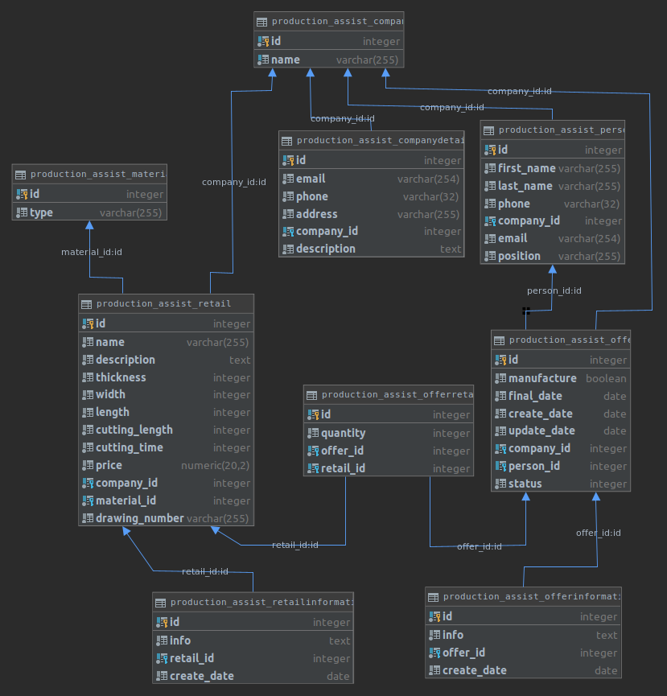
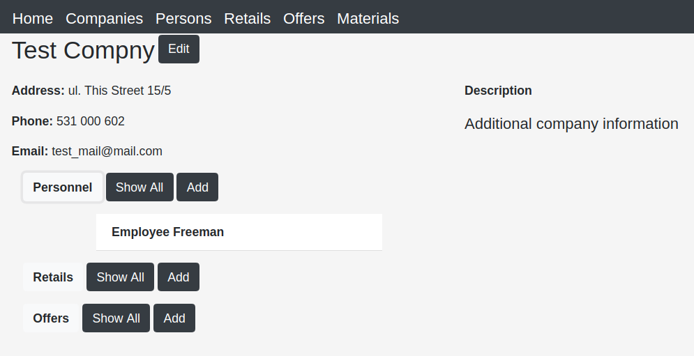
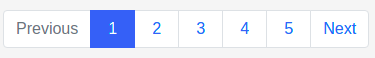
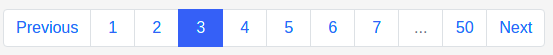
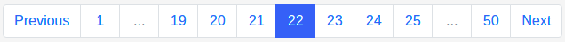
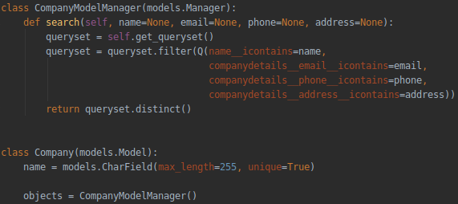
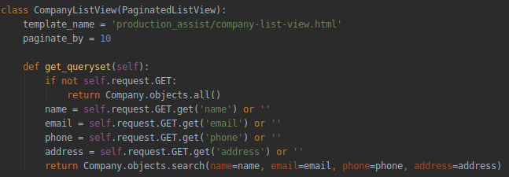
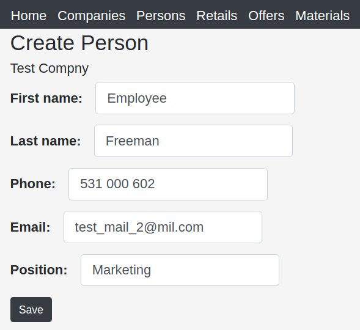

# Production Management App
Application purpose is to show essential skills in programming. 
It contains basic tools to manage flow of information within manufacturing company.
This includes information about cooperating companies with personnel contact data, offers and retails that cooperating companies ordered previously.
* __Used technologies:__
    * Django, Python
    * jQuery 
    * HTML5, CSS (Bootstrap)
    * PostgreSQL

* __Database__ 

    Framework Django along with Python were used to manage database records and implement utility for application.
    Database is populated during migrations by using external module __faker__.
    
    
    
    
    
* __Custom pagination Navbar__

    For custom pagination I have created new View based on generic ListView.
    In PaginatedListView function __get_context_data()__ get extended by new
    variable __page_range__ that is used later on. 
    If page is paginated additional template is loaded which determine formatting of pagination NavBar.

    
    
    
    
    

* __Extended model.Manager__
    
    Standard Model.Manager for Company model and Person Model is upgraded with custom function __search__ for easy 
    filtering data on Company/Person List View
    
    > models.py  
    
    
    > views.py  
    
    
    
* __jQuery__

    Django forms are created automatically, so jQuery comes in action to create custom style of form.
    jQuery is also used to add events to expandable items for additional information.
    
    
